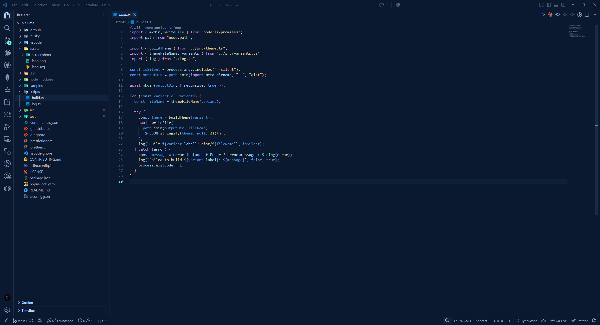
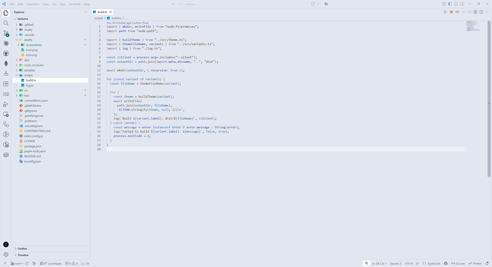

# Biolume

A deep-sea theme in dark and light: a mint glow on deep navy or soft paper.



## Themes

Biolume comes in two themes:

- **Biolume**: deep navy with a mint glow.
- **Biolume Light**: soft paper with deep green accents.



## Install

1. Open the **Extensions** view (`Ctrl+Shift+X`, or `Cmd+Shift+X` on macOS), search for **Biolume** and select **Install**.
2. Run **Preferences: Color Theme** (`Ctrl+K Ctrl+T`, or `Cmd+K Cmd+T` on macOS) and pick **Biolume** or **Biolume Light**.

Or install it from the command line:

```sh
code --install-extension biolume.biolume
```

Biolume is also on [Open VSX](https://open-vsx.org/extension/biolume/biolume), for VSCodium and other editors that use it.

## License

[MIT](LICENSE)
